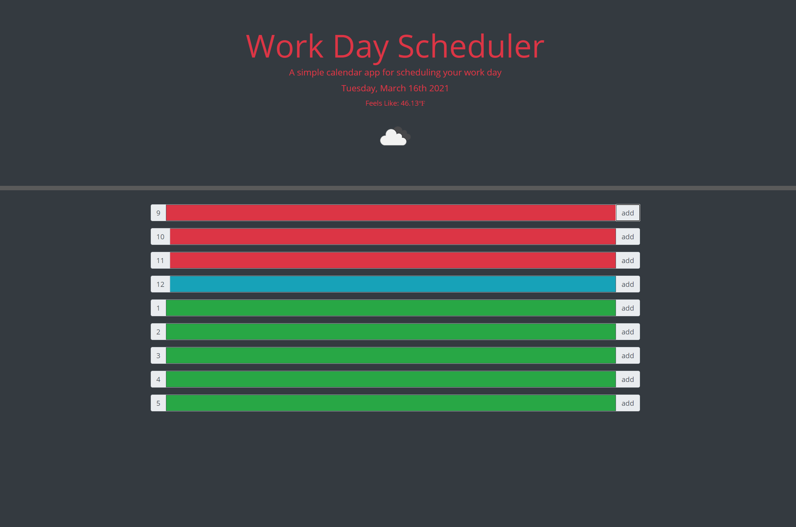

# Work_Day_Scheduler

## Description
Daily planner, divided by work hours.

## Instructions
Click on any hour section in the list in the colored input area and add any events you'd like. Then click add and the event will be saved! To change an event, simply go into the input area for that section, change the text to anything you want, and click add and your changes will be saved!
Colors of each box represent; Red: Hours that have already passed in the day. Blue: Current hour you are in. Green: Hours that have yet to come.

## Site Link
https://tadhgmc.github.io/work-day-scheduler/
